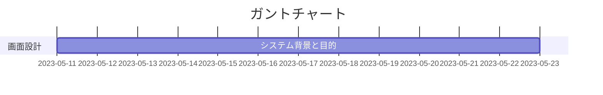
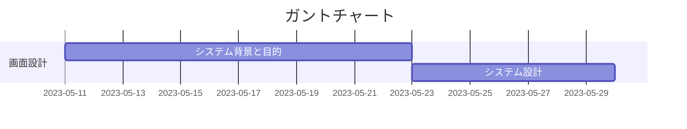
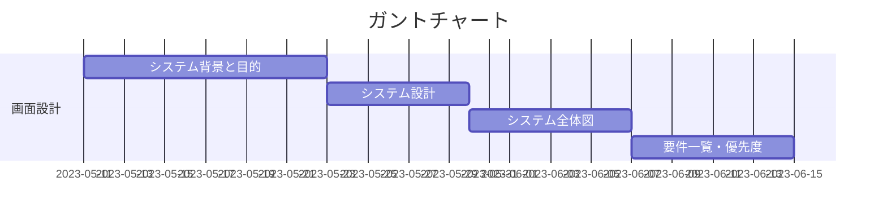

# mermaidで記述できるダイアグラムのチュートリアル

#### 引用
>MerMaidの公式サイトドキュメントは[こちら](https://mermaid.js.org/intro/)です。

今回はmermaidでガントチャートを作成するチュートリアルを記述します。

- 上記のガントチャートの記述コードはこちらになります
>gantt
    title ガントチャート
    section 画面設計
    システム背景と目的 :2023-05-11, 12d

※上記のコードの場合5-11の12d(12日かかる)ということなので5-23まで伸びています。

>gantt
    title ガントチャート
    section 画面設計
    システム背景と目的 :2023-05-11, 12d
    システム設計    :7d

※続いて追加したい場合は上記のように続けていけば良いです。日付を入力しない場合は段々になります。日付を指定すれば、その日付から始まります。

- 上記のダイアグラムの記述コードはこちらになります
>gantt
    title ガントチャート
    section 画面設計
        システム背景と目的 :2023-05-11, 12d
        システム設計    :7d
        システム全体図    :8d
        要件一覧・優先度  :8d