 --- 

 | 作成者 | 作成日  | 更新者 | 更新日 |
 | ------ | ------ | -------- | -------- |
 | 盛岡太郎    | 2022/04/01   |      |      |  

- プロジェクト名：取引先企業検索システム 

 --- 
## 1. システム概要

### 1-1. システムの背景と目的
  - 背景   
   自社では取引企業が多岐にわたり、県内外の企業を対象にしており、IT業界100社、卸売業者50社、製造業30社との取引先企業の情報をある部署のコンピュータ1台で管理している。各部署の社員は情報取得する場合、その部署に行く必要がある為、効率が悪く利用しにくい。
   　また、今後取引企業が増えることが予想され効率よく情報を取り出す必要がある。
   
  - 目的   
    1台のコンピュータで管理している現システムをネットワークを利用したWebシステムに変更し、ブラウザを利用して各部署からでも情報を取り出せるように効率の向上をする。
    　また、検索条件として企業の所在県、業種を設定検索できることとする。
 --- 

### 1-2. ユースケース図

 --- 
### 1-3. システムの全体図

 UC001：管理者がログインをする
   UC002：管理者が企業情報を登録する
   UC003：管理者が企業情報を編集する
   UC004：管理者が企業情報を消去する
   UC005：利用者がログインする
   UC006:全データを表示する
   UC006-2:県より検索する
   UC006-3:業種より検索する

### 1-4. 要求一覧
| 大分類 | 小分類 | 要件 | 優先度 | 備考 |
| ----| ---- | ---- | ---- | ---- |
| 基本要件 | 利用環境 |サービスの利用にあたって、クライアント端末にアプリケーションをインストールすることなくブラウザから利用できる|高|  |
||ユーザ管理|ユーザIDとパスワードを用いたログインができる|高||
||デザイン|サイト全体として、統一されたページデザインにすること|中||
|検索要件 |所在県検索|指定した所在県より抽出が出来る|高|複合条件でも検索可能とする|
||業種検索|指定した業種より抽出が出来る|高|複合条件でも検索可能とする|
||条件無し|すべての企業を抽出できる|高|複合条件でも検索可能とする|
| 企業情報登録 | 企業情報登録 |管理画面から企業情報を登録することが出来る| 高|  |
| 企業情報保守 |企業情報編集|管理画面から企業情報を編集することが出来る|高|  |
| 企業情報保守 |企業情報削除|管理画面から企業情報を削除することが出来る|高|  |

