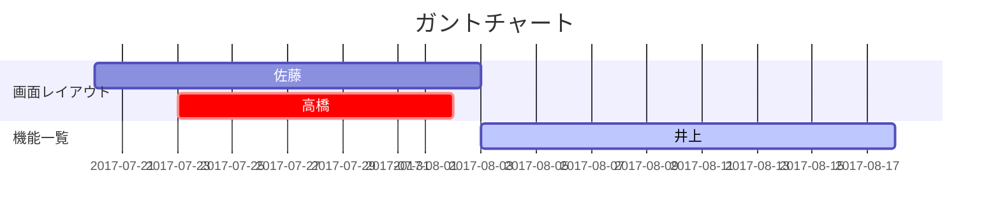

 --- 

 | 作成者 | 作成日  | 更新者 | 更新日 |
 | ------ | ------ | -------- | -------- |
 | 盛岡太郎    | 2022/04/01   |      |      |      |

- プロジェクト名：取引先企業検索システム 
- ソフトウェア名：○○○○○○○○○○○○○ 

 --- 
## 1. システム概要

### 1-1. システムの背景と目的
  - 背景   
   自社では取引企業が多岐にわたり、県内外の企業を対象にしており、IT業界100社、卸売業者50社、製造業30社との取引先企業の情報をある部署のコンピュータ1台で管理している。各部署の社員は情報取得する場合、その部署に行く必要がある為、効率が悪く利用しにくい。
   　また、今後取引企業が増えることが予想され効率よく情報を取り出す必要がある。
   
  - 目的   
    1台のコンピュータで管理している現システムをネットワークを利用したWebシステムに変更し、ブラウザを利用して各部署からでも情報を取り出せるように効率の向上をする。
    　また、検索条件として企業の所在県、業種を設定検索できることとする。
 --- 

### 1-2. ユースケース図

 --- 
### 1-3. システムの全体図

 UC001：管理者がログインをする
   UC002：管理者が企業情報を登録する
   UC003：管理者が企業情報を編集する
   UC004：管理者が企業情報を消去する
   UC005：利用者がログインする
   UC006:全データを表示する
   UC006-2:県より検索する
   UC006-3:業種より検索する

  

#### ソフトウェア構成
    ○○○○○○○○○○○○○○○○○○ 
    ○○○○○○○○○○○○○○○○○○ 
    ○○○○○○○○○○○○○○○○○○ 

#### ハードウェアの構成
    ○○○○○○○○○○○○○○○○○○ 
    ○○○○○○○○○○○○○○○○○○ 
    ○○○○○○○○○○○○○○○○○○ 

#### ネットワークの構成
    ○○○○○○○○○○○○○○○○○○ 
    ○○○○○○○○○○○○○○○○○○ 
    ○○○○○○○○○○○○○○○○○○ 

#### 実行環境
    ○○○○○○○○○○○○○○○○○○ 
    ○○○○○○○○○○○○○○○○○○ 
    ○○○○○○○○○○○○○○○○○○ 

 --- 
### 1-4. 要求一覧
> ※指示）アプリケーションに求められる要件を、大分類、小分類、要件、優先度、備考等に分けて表形式で記述する
  

 --- 
#### 1-5. 開発スケジュール
> ※指示）10月末の検収日としてスケジュールを設定してください。
> 図表は、**Mermaid**または**PlantUML**により作成してください。
> 「**Markdown Preview Mermaid Support**」「**Markdown Preview Enhanced**」をインストールするとよい。
>(参考URL)  
>[GitHub で Mermaid がサポートされました](https://zenn.dev/yasuhiroki/articles/dd0feae790ba41)  
>[PlantUMLでガントチャート](https://plantuml.com/ja-dark/gantt-diagram)

 | No             | タスク名      | 開始日  | 内容    |
 | -------------- | ------------- | ------- | ------- |
 | YYYY年MM月DD日 | ○○○○○○○○○○○○○ | ○○○○○○○ | ○○○○○○○ |
 | YYYY年MM月DD日 | ○○○○○○○○○○○○○ | ○○○○○○○ | ○○○○○○○ |
 | YYYY年MM月DD日 | ○○○○○○○○○○○○○ | ○○○○○○○ | ○○○○○○○ |
 | YYYY年MM月DD日 | ○○○○○○○○○○○○○ | ○○○○○○○ | ○○○○○○○ |

###### marmaidで記載した例

#### 1-6. 担当表
> ※指示）4名の開発要員で構成してください。

    ○○○○○○○○○○○○○○○○○○ 
    ○○○○○○○○○○○○○○○○○○ 
    ○○○○○○○○○○○○○○○○○○ 

 --- 
